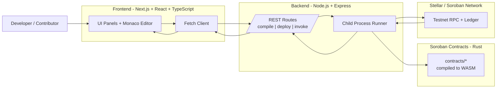

# Soroban Playground

Soroban Playground is a browser-based IDE for writing, compiling, deploying, and interacting with Stellar Soroban smart contracts.
No setup required. Write Rust smart contracts directly in your browser.

## Features
- **Code Editor**: Monaco-based editor with Rust syntax highlighting, auto-formatting, and contract templates.
- **In-browser Compilation**: Compile Soroban contracts online and view logs/WASM outputs.
- **Deploy to Testnet**: Deploy your contracts instantly to the Stellar Testnet.
- **Contract Interaction**: Read and write functions easily via an auto-generated UI.
- **Storage Viewer**: Explore contract storage keys and values

## Project Structure
This repository uses a monorepo setup:
- `frontend/`: The Next.js React application containing the UI
- `backend/`: The Node.js Express application responsible for Soroban CLI interactions.

## Getting Started

### Prerequisites
- Node.js (v18+)
- NPM or Yarn
- Rust (for the backend compilation engine)
- Soroban CLI

### Local Setup
1. Clone the repository:
   ```bash
   git clone https://github.com/your-username/soroban-playground.git
   ```
2. Install dependencies for all workspaces:
   ```bash
   npm install
   ```
3. Start the application stack (Frontend and Backend concurrently):
   ```bash
   npm run dev
   ```

## Contributing
We welcome contributions! Please see our [CONTRIBUTING.md](./CONTRIBUTING.md) for guidelines on how to get started.

## License
MIT License.
# Soroban Playground

Soroban Playground is a browser-based IDE for writing, compiling, deploying, and interacting with Stellar Soroban smart contracts.
No setup required. Write Rust smart contracts directly in your browser.

> [!NOTE]
> **🚧 Project Status:** The Soroban Playground Frontend, Backend, and Core Smart Contracts are successfully deployed to the Stellar Testnet and are fully operational! However, the project is still under active development. We have established this strong foundation with the goal of polishing and completing the entire ecosystem for the next wave.
> 
> **Roadmap for the Next Wave:**
> - **Complete Test Coverage:** Finalize our comprehensive end-to-end test suites, specifically targeting Synthetic Assets and complex DeFi contract scenarios.
> - **Wallet & UX Refinement:** Perfect the Freighter wallet integration and completely polish the UI/UX to ensure a premium, mainnet-ready user experience.
> - **Advanced IDE Features:** Finish implementing our in-browser advanced debugging tools, real-time multi-contract simulators, and visual transaction trace graphs.

### 🌐 Live Deployments
- **Frontend (Vercel)**: [https://soroban-playground-frontend-f1rz-fyzeokbr5.vercel.app](https://soroban-playground-frontend-f1rz-fyzeokbr5.vercel.app)
- **Backend API (Render)**: [https://soroban-playground.onrender.com](https://soroban-playground.onrender.com)

## Features
- **Code Editor**: Monaco-based editor with Rust syntax highlighting, auto-formatting, and contract templates.
- **In-browser Compilation**: Compile Soroban contracts online and view logs/WASM outputs.
- **Deploy to Testnet**: Deploy your contracts instantly to the Stellar Testnet.
- **Contract Interaction**: Read and write functions easily via an auto-generated UI.
- **Storage Viewer**: Explore contract storage keys and values.
- **Yield Optimizer MVP**: Cross-protocol strategy simulation with deposits, withdrawals, auto-compounding, and deterministic backtesting.
- **Patent Registry MVP**: Decentralized patent registration, verification, and licensing marketplace with smart contract validation.

## Tech Stack Diagram



### How To Read This Diagram
1. Start from the left: a contributor writes or updates contract code in the browser UI.
2. Follow the center: the frontend calls backend API routes for compile, deploy, and invoke actions.
3. End on the right: backend tools compile Rust contracts to WASM and interact with Soroban on Stellar Testnet, then return results to the UI.

### Stack At A Glance
- **Frontend** (`frontend/`): Next.js app router UI, Monaco editor integration, and interactive panels for compile/deploy/invoke flows.
- **Backend** (`backend/`): Express API routes (`/compile`, `/deploy`, `/invoke`) that orchestrate Soroban toolchain commands.
- **Smart Contracts** (`contracts/`): Example Soroban contracts written in Rust, compiled to WASM, and deployed/invoked via backend routes.
- **Toolchain**: Rust + Cargo + Soroban CLI for compilation and network interactions.

## Project Structure
This repository uses a monorepo setup:
- `frontend/`: The Next.js React application containing the UI.
- `backend/`: The Node.js Express application responsible for Soroban CLI interactions.

## Getting Started

### Prerequisites
- Node.js (v18+)
- NPM or Yarn
- Rust (for the backend compilation engine)
- Soroban CLI

### Local Setup
1. Clone the repository:
   ```bash
   git clone https://github.com/your-username/soroban-playground.git
   ```
2. Install dependencies for all workspaces:
   ```bash
   npm install
   ```
3. Start the application stack (Frontend and Backend concurrently):
   ```bash
   npm run dev
   ```

## Contributing
We welcome contributions! Please see our [CONTRIBUTING.md](./CONTRIBUTING.md) for guidelines on how to get started.

## Yield Optimizer (Issue #316)

This repository includes a smallest-complete implementation across contract, backend, and frontend:

- Soroban contract example: `contracts/yield-optimizer`
- Backend APIs: `backend/src/routes/optimizer.js`
- Frontend dashboard: `frontend/src/app/yield-optimizer/page.tsx`
- **Live Testnet Contract ID**: `CCQBGRD7SVNDXK6KWX2LYSADHXBQCYOJOU5D3DQIOUZ4E3RTLP544H2D`

## Patent Registry (Issue #350)

Decentralized patent registry with invention verification and licensing marketplace:

- Soroban contract example: `contracts/patent-registry`
- Backend APIs: `backend/src/routes/patentRegistry.js`
- Backend service: `backend/src/services/patentRegistryService.js`
- Frontend service: `frontend/src/services/patentRegistryService.ts`
- Frontend dashboard: `frontend/src/app/patent-registry/page.tsx`
- **Live Testnet Contract ID**: `CAUNUHUXFT2PVWAJEFELNIKLVHHPQX3NPWWFUHMBIEFOR4ZPTN24CK7Q`

Features:
- Register patents with metadata URIs and hashes
- Verify patents through designated verifiers
- Create and manage license offers
- Accept licenses with payment references
- View all patents, verified inventions, and active license offers

### Contract Summary

`contracts/yield-optimizer` supports:

- strategy create/update/list
- user deposit and withdraw
- share and balance tracking per user position
- executor/admin-only compound flow
- emergency pause/unpause
- events on strategy create/update, deposit, withdraw, and compound

### Backend API Examples

Base URL: `http://localhost:5000/api/optimizer`

Create strategy:

```bash
curl -X POST http://localhost:5000/api/optimizer/strategies \
   -H "Content-Type: application/json" \
   -H "x-actor-address: GOPTIMIZERADMIN000000000000000000000000000000000000" \
   -d '{
      "name":"Cross-Protocol Stable Vault",
      "protocol":"Blend + Aquarius",
      "apyBps":1200,
      "feeBps":250,
      "compoundInterval":86400
   }'
```

Deposit:

```bash
curl -X POST http://localhost:5000/api/optimizer/strategies/1/deposit \
   -H "Content-Type: application/json" \
   -H "x-actor-address: GUSERADDRESS" \
   -d '{"amount":5000}'
```

Run deterministic backtest:

```bash
curl -X POST http://localhost:5000/api/optimizer/backtest \
   -H "Content-Type: application/json" \
   -d '{
      "depositAmount":10000,
      "days":30,
      "apyBps":1200,
      "feeBps":250,
      "compoundEveryDays":7
   }'
```

### Backtesting Assumptions

- deterministic mocked return series (no external market fetch)
- strategy protocol text is used as metadata only
- fees are applied on compound checkpoints
- output includes projected yield, APY, drawdown, fees, and daily equity series

### Deployment/Configuration

Optional backend environment variables:

- `OPTIMIZER_ADMIN_ADDRESS`
- `OPTIMIZER_EXECUTOR_ADDRESS`

Frontend API override:

- `NEXT_PUBLIC_API_URL` (defaults to `http://localhost:5000/api`)

## License
MIT License.

---

## Quadratic Voting System

A full-stack quadratic voting implementation built on Soroban.

**Live Testnet Contract ID**: `CDKPQE3TWTBF3BLA2IZSFHLXRCTRCPWHFTGBVH6WWPDAEKT3FEJQVBP4`

### How Quadratic Voting Works

Voters spend **credits** to cast votes. The number of votes received equals `floor(sqrt(credits))`:

| Credits | Votes | Cost per extra vote |
|---------|-------|---------------------|
| 1       | 1     | 1                   |
| 4       | 2     | 3                   |
| 9       | 3     | 5                   |
| 16      | 4     | 7                   |
| 100     | 10    | 19                  |

This makes each additional vote progressively more expensive, preventing whale dominance.

### Architecture

```
contracts/quadratic-voting/   ← Soroban/Rust smart contract
backend/src/routes/quadraticVoting.js    ← REST API routes
backend/src/services/quadraticVotingService.js  ← Business logic + caching
backend/src/docs/quadraticVoting.doc.js  ← OpenAPI documentation
frontend/src/components/QuadraticVotingDashboard.tsx  ← React UI
frontend/src/app/quadratic-voting/page.tsx  ← Next.js page
```

### Smart Contract

**Location:** `contracts/quadratic-voting/`

**Functions:**

| Function | Access | Description |
|----------|--------|-------------|
| `initialize(admin, voting_period?, max_credits?)` | Public (once) | Initialize contract |
| `create_proposal(admin, title, description, duration?)` | Admin | Create a proposal |
| `cancel_proposal(admin, proposal_id)` | Admin | Cancel active proposal |
| `whitelist(admin, voter, allow)` | Admin | Add/remove voter |
| `vote(voter, proposal_id, credits, is_for)` | Whitelisted | Cast quadratic vote |
| `finalize(proposal_id)` | Anyone | Finalize after voting ends |
| `pause(admin)` / `unpause(admin)` | Admin | Emergency pause |
| `get_proposal(id)` | Read | Fetch proposal data |
| `credits_to_votes(credits)` | Read | Calculate votes from credits |

**Events emitted:** `init`, `proposed`, `voted`, `finalized`, `cancelled`, `paused`, `unpaused`, `wl`

**Security patterns:**
- Checks-effects-interactions ordering
- Admin-only access control via `require_auth()`
- Emergency pause mechanism
- Per-voter credit limits
- One vote per voter per proposal

### Building the Contract

```bash
cd contracts/quadratic-voting
cargo build --target wasm32-unknown-unknown --release

# Run tests
cargo test
```

### Deploying to Testnet

```bash
# Build WASM
cargo build --target wasm32-unknown-unknown --release

# Deploy
stellar contract deploy \
  --wasm target/wasm32-unknown-unknown/release/quadratic_voting.wasm \
  --source <YOUR_ACCOUNT> \
  --network testnet

# Initialize (replace CONTRACT_ID and ADMIN_ADDRESS)
stellar contract invoke \
  --id <CONTRACT_ID> \
  --source <YOUR_ACCOUNT> \
  --network testnet \
  -- initialize \
  --admin <ADMIN_ADDRESS> \
  --voting_period 604800 \
  --max_credits 100
```

### Backend API

Base URL: `http://localhost:5000/api/quadratic-voting`

| Method | Endpoint | Description |
|--------|----------|-------------|
| POST | `/initialize` | Initialize contract |
| POST | `/proposals` | Create proposal |
| GET | `/proposals/:id?contractId=` | Get proposal |
| GET | `/proposals/count?contractId=` | Get proposal count |
| POST | `/proposals/:id/finalize` | Finalize proposal |
| POST | `/proposals/:id/cancel` | Cancel proposal |
| POST | `/vote` | Cast vote |
| POST | `/whitelist` | Add/remove voter |
| GET | `/whitelist/:voter?contractId=` | Check whitelist |
| POST | `/pause` | Pause contract |
| POST | `/unpause` | Unpause contract |
| GET | `/status?contractId=` | Get pause status |
| GET | `/credits-to-votes?credits=` | Calculate votes |

Full OpenAPI docs available at `http://localhost:5000/api-docs` when the backend is running.

**Example: Cast a vote**
```bash
curl -X POST http://localhost:5000/api/quadratic-voting/vote \
  -H "Content-Type: application/json" \
  -d '{
    "contractId": "C...",
    "voter": "G...",
    "proposalId": 0,
    "credits": 9,
    "isFor": true
  }'
# Response: { "success": true, "data": { "votesReceived": 3, "creditsSpent": 9 } }
```

### Frontend

Navigate to `http://localhost:3000/quadratic-voting` to access the dashboard.

Features:
- Create proposals (admin)
- Interactive credit slider with real-time vote preview
- Vote for/against with quadratic cost display
- Proposal status tracking with vote bars
- Whitelist management (admin tab)
- Emergency pause/unpause (admin tab)
- WCAG 2.1 AA accessible (ARIA labels, roles, live regions)

### Running Tests

**Contract tests:**
```bash
cd contracts/quadratic-voting
cargo test
```

**Backend tests:**
```bash
cd backend
npx jest tests/quadraticVoting.test.js
```

### Environment Variables

Add to `backend/.env`:
```
# Optional: default contract ID for quadratic voting
QV_CONTRACT_ID=C...
```

Add to `frontend/.env.local`:
```
NEXT_PUBLIC_API_URL=http://localhost:5000
NEXT_PUBLIC_QV_CONTRACT_ID=C...
```

---

## Price Feed Aggregator

A production-ready on-chain price aggregator that combines multiple data sources into a single tamper-resistant price, essential for synthetic assets, stablecoins, and other DeFi applications.

### How It Works

Multiple reporters submit prices independently. The contract filters stale and inactive sources, removes statistical outliers, and applies the configured aggregation strategy (Median, Weighted Average, or Trimmed Mean) to produce a final price.

### Architecture

```
contracts/price-feed-aggregator/   ← Soroban/Rust smart contract
```

### Smart Contract

**Location:** `contracts/price-feed-aggregator/`

**Functions:**

| Function | Access | Description |
|----------|--------|-------------|
| `initialize(admin, asset, decimals?, max_price_age?, outlier_bps?, circuit_breaker_bps?, strategy?)` | Public (once) | Initialize contract |
| `add_source(admin, reporter, description, weight?)` | Admin | Register a price source |
| `remove_source(admin, source_id)` | Admin | Deactivate a source |
| `set_weight(admin, source_id, weight)` | Admin | Update source weight (1–100) |
| `update_price(reporter, source_id, price)` | Reporter | Submit a price update |
| `get_price(source_id)` | Read | Raw price for one source |
| `get_aggregated_price()` | Read | Aggregated price across all valid sources |
| `pause(admin)` / `unpause(admin)` | Admin | Emergency pause |

**Aggregation strategies:** `Median` (default), `WeightedAverage`, `TrimmedMean`

**Security features:**
- Circuit breaker — rejects single-update swings above `circuit_breaker_bps` (default 30%)
- Outlier detection — excludes sources deviating > `outlier_bps` from the median (default 20%)
- Stale price exclusion — ignores prices older than `max_price_age` (default 1 hour)
- Per-source reporter authentication via `require_auth()`
- Emergency pause mechanism

**Events emitted:** `init`, `paused`, `unpaused`, `srcadd`, `srcrm`, `priceupd`

### Building the Contract

```bash
cd contracts/price-feed-aggregator
cargo build --target wasm32-unknown-unknown --release

# Run tests
cargo test
```
